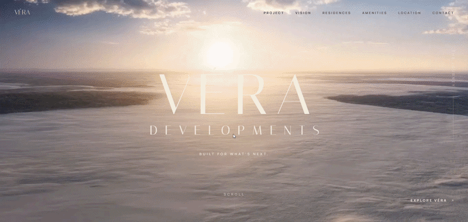

# VÉRA Developments

### Cinematic Real Estate Web Experience

<p align="center">
  
</p>

A premium real estate landing page designed around cinematic storytelling, immersive scroll interactions, and a sophisticated visual system.

**Live Demo:** https://vera-liard-one.vercel.app/

---

## Overview

VÉRA Developments is a high-end real estate web experience focused on presenting property development through a cinematic digital journey rather than a traditional landing page.

The interface combines:

* Cinematic scroll-driven animations
* Editorial-inspired typography
* Premium real estate visual direction
* Responsive layouts
* Smooth section transitions
* Performance-conscious asset handling
* Modern frontend architecture

The goal was to create an experience that feels closer to a luxury brand film than a conventional real estate website.

---

## Experience

The page is structured as a visual narrative.

Instead of relying on a traditional:

`Hero → Features → Cards → CTA`

structure, the experience uses movement, scale, typography and visual transitions to guide the user through the project.

### Core experience

**01 — Introduction**

A cinematic opening establishes the VÉRA identity and visual language.

**02 — Brand Story**

Typography and composition introduce the development concept while maintaining a minimal editorial aesthetic.

**03 — Property Experience**

Visual content becomes the primary storytelling element, allowing the user to progressively explore the development.

**04 — Information**

Important project details are introduced without breaking the visual flow.

**05 — Conversion**

The experience concludes with clear calls-to-action while maintaining the premium visual language.

---

## Key Features

### Cinematic Scroll Experience

Scroll position is used as an interaction mechanism to progressively reveal and transition between visual states.

### Responsive Design

The experience adapts across:

* Desktop
* Laptop
* Tablet
* Mobile

Layouts, typography, spacing and animation behavior are adjusted according to viewport size.

### Premium Visual System

The design uses:

* Strong typographic hierarchy
* Editorial spacing
* Controlled contrast
* Large-scale imagery
* Minimal UI
* Cinematic transitions

### Performance-Oriented Animation

Animations are designed to avoid unnecessary continuous work and activate only when required.

### Vite Production Build

The project uses Vite for fast development, optimized production builds and efficient asset handling.

---

## Tech Stack

| Technology | Purpose                                         |
| ---------- | ----------------------------------------------- |
| TypeScript | Application logic and type safety               |
| Vite       | Development environment and production bundling |
| HTML       | Semantic page structure                         |
| CSS        | Layout, responsive design and visual system     |
| JavaScript | Interaction and animation logic                 |
| Vercel     | Deployment                                      |

---

## Animation Architecture

The animation system is based around scroll-driven storytelling.

Instead of treating animation as decorative effects, motion is used to communicate progression through the page.

### Animation principles

* Scroll-based progression
* Smooth interpolation
* Section-based animation states
* Viewport-aware behavior
* Responsive animation scaling
* Controlled asset rendering
* Reduced unnecessary animation work

The system is designed so that visual movement supports the narrative instead of competing with the content.

---

## Performance

Performance was considered as part of the implementation.

Key considerations include:

* Optimized production builds
* Lazy loading of non-critical assets
* Avoiding unnecessary animation loops
* Responsive asset sizing
* Minimizing initial rendering cost
* Limiting expensive visual effects
* Keeping animation logic modular

The objective is to maintain the cinematic visual experience without sacrificing usability.

---

## Responsive Experience

The design was not treated as a desktop-only composition.

The interface adapts its:

* Typography
* Spacing
* Content hierarchy
* Image proportions
* Navigation
* Animation behavior

to smaller screens.

On mobile, visual complexity is reduced where necessary to maintain usability and performance.

---

## Design Direction

The visual direction is inspired by premium architecture, luxury real estate and contemporary editorial design.

The system intentionally avoids excessive UI elements and instead relies on:

**Typography + Space + Imagery + Motion**

to create the brand experience.

---

## Project Structure

```text
src/
├── assets/
├── components/
├── sections/
├── animations/
├── styles/
├── utils/
├── App.tsx
└── main.tsx
```

> Adjust this structure to match the actual source tree before publishing the repository.

---

## Getting Started

### Clone

```bash
git clone YOUR_REPOSITORY_URL
cd vera-developments
```

### Install dependencies

```bash
npm install
```

### Start development server

```bash
npm run dev
```

The application will be available locally through the Vite development server.

---

## Production Build

Create an optimized production build:

```bash
npm run build
```

Preview the production build locally:

```bash
npm run preview
```

---

## Deployment

The project is deployed using Vercel.

Production workflow:

```text
GitHub
   ↓
Vercel
   ↓
Production Build
   ↓
Live Experience
```

---

## Challenges & Solutions

### Challenge 01 — Creating a cinematic experience without overwhelming the user

A real estate website needs to communicate information clearly while still feeling visually impressive.

**Solution**

The experience uses progressive storytelling, controlled transitions and strong typographic hierarchy so that motion supports the content instead of distracting from it.

---

### Challenge 02 — Maintaining responsiveness with animation

Large desktop compositions do not always translate directly to mobile.

**Solution**

The layout and animation behavior are adapted based on viewport size instead of simply scaling the desktop experience down.

---

### Challenge 03 — Balancing visual quality and performance

Cinematic effects and large visual assets can quickly increase page weight.

**Solution**

Assets and animations are handled selectively, with emphasis on optimized loading and avoiding unnecessary rendering work.

---

## What I Focused On

This project was built with particular attention to:

* Frontend engineering
* Creative development
* Interaction design
* Motion design
* Responsive systems
* Performance
* Visual storytelling
* Component organization

---

## Future Improvements

Potential improvements include:

* Advanced image preloading
* More sophisticated scroll synchronization
* WebGL-based visual effects
* Reduced-motion accessibility mode
* Additional project/property pages
* CMS integration
* Advanced analytics
* Further Core Web Vitals optimization

---

## Status

**Completed**

The project is currently deployed and available as a live experience.

---

## License

This project is presented as a portfolio project.

All visual assets, branding and content belong to their respective owners.
